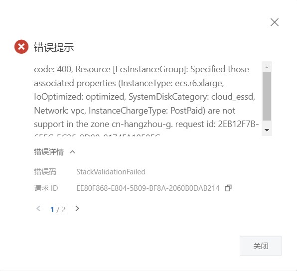

# AtlasGraph 服务实例部署文档

## 概述

AtlasGraph 是海致星图自研的的高性能图数据库（Graph Database）。AtlasGraph 在计算巢上提供了服务，可在计算巢上快速部署 AtlasGraph，从而搭建您自己的图应用。本文向您介绍如何开通计算巢上的 AtlasGraph 服务，以及部署流程和使用说明。

欢迎大家申请使用，期间发现任何问题也欢迎反馈交流。

## 部署流程

在正式开始使用前，您需要一个阿里云账号，对ECS、VPC等资源进行访问和创建操作。

- 若您使用个人账号，可以直接创建服务实例
- 若您使用RAM用户创建服务实例，且是第一次使用阿里云计算巢
    - 需要在创建服务实例前，对使用的RAM用户的账号添加相应资源的权限。添加RAM权限的详细操作，请参见[为RAM用户授权](https://help.aliyun.com/document_detail/121945.html)。所需权限如下表所示。
    - 且需要授权创建关联角色，参考下图，选中 **同意授权并创建关联角色**

| 权限策略名称                    | 备注                                    |
|---------------------------------|---------------------------------------|
| AliyunECSFullAccess             | 管理云服务器服务（ECS）的权限             |
| AliyunVPCFullAccess             | 管理专有网络（VPC）的权限                 |
| AliyunROSFullAccess             | 管理资源编排服务（ROS）的权限             |
| AliyunComputeNestUserFullAccess | 管理计算巢服务（ComputeNest）的用户侧权限 |

### 1. 部署入口

您可以在阿里云计算巢自行搜索，也可以通过下述部署链接快速到达。

[部署链接](https://computenest.console.aliyun.com/service/instance/create/cn-hangzhou?type=user&ServiceId=service-0aabc7f118d148c1bbfc)

### 2. 创建AtlasGraph服务

#### 2.1 参数列表

您在创建服务实例的过程中，需要配置服务实例信息的参数列表，具体如下：

| 参数组               | 参数项   | 示例          | 说明                                                           |
|---------------------|----------|---------------|--------------------------------------------------------------|
| 服务实例名称          | N/A      | atlas_graph-2v30  | 实例的名称                                                 |
| 地域                 | N/A      | 华北2（北京）   | 选中服务实例的地域，建议就近选中，以获取更好的网络延时。              |
| 选择已有基础资源配置   | VPC ID   | vpc-xxx       | 按实际情况，选择专有网络的ID。                                    |
| 可用区配置           | 部署区域   | 可用区I        | 地域下的不同可用区域，确保实例非空。                                |
| 选择已有基础资源配置   | 交换机ID  | vsw-xxx       | 按实际情况，选择交换机ID。若找不到交换机, 可尝试切换地域和可用区。      |
| 选择已有基础资源配置   | K8s集群ID | xxx/xxx       | 按实际情况，选择容器服务 ACK 集群 ID。                             |
| 部署应用程序的K8s命名空间 | N/A    | atlasgraph    | 选择集群中不存在的 namespace。                                  |
| 付费类型配置         | 付费类型    | 按量付费       | 请按需求选择按量付费或者包年包月。                                |

#### 2.2 具体步骤

创建服务按如下步骤进行，参考下图：

- 创建实例名称，如下图中“atlas_graph-2v30”
- 选择地域，如下图中“华北2（北京）”

- 选择 VPC ID
- 选择可用区
- 选择交换机 ID

- 选择 K8s 集群 ID
- 设置部署应用程序的 K8s 命名空间

- 选择付费类型

- 点击下一步，进入订单确认页面
- 勾选“权限确认”和“服务条款”中的复选框
- 点击“立即创建”即可等待服务自动部署

### 3. 启动 AtlasGraph 服务

- 查看服务实例：服务实例创建成功后，部署时间大约需要3分钟。部署完成后，页面上可以看到对应的服务实例，如下图：

- 点击该服务实例访问 AtlasGraph。进入到对应的服务实例后，可以在页面上获取到 Web IP。

- 使用该 web 地址，即可访问已经部署好的 AtlasGraph Web。

- 使用默认的账号密码（root/root）登录，即可进入到 AtlasGraph Web 的首页。

## 常见问题FAQ

### 问题一：部署区域无可用资源

有时，所选部署区域（如可用区G）没有所选套餐的可用资源，会报错如下图所示

**解决办法**：尝试选择其他区域，如可用区I等

### 问题二: 启动后web访问不通

web的启动需要一点点时间，请稍后刷新页面即可。

## 联系我们

欢迎访问 AtlasGraph 官网（[https://www.stargraph.cn](https://www.stargraph.cn)）了解更多信息。

扫码关注微信公众号，技术博客、活动通知不容错过：

